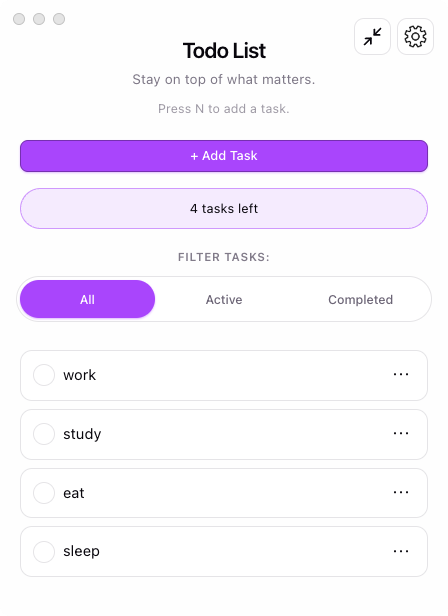

# TodoList

A small todo app I wrote for myself, in two flavors:

- `to-do-list/` — the web version (React + Vite).
- `desktop/` — the macOS version, built on top of the web app with Electron.



## Install (macOS)

Grab a `.dmg` from `desktop/release/` and open it:

- `TodoList-0.2.0-arm64.dmg` for Apple Silicon (M1/M2/M3).
- `TodoList-0.2.0.dmg` for Intel Macs.

Drag `TodoList.app` into `Applications`. The build is unsigned, so the first time you launch it, right-click the app and pick **Open** to get past Gatekeeper. Once that's done, double-click works as usual.

Unistall in `Applications` folder.

## Features (macOS app)

- Add, edit, delete tasks.
- Tick tasks off, and undo the last "clear completed" if you didn't mean to.
- Filter by all / active / completed.
- Drag to reorder.
- Tag tasks with colors.
- Settings panel: light / dark / follow system, where new tasks get inserted (top or bottom), whether the input closes after adding, custom color presets, and a one-click "clear all".
- Keyboard shortcut `n` to start a new task.
- Data lives in `localStorage`, so your list stays put between launches.
- The window can float on top. (Window -> Always on top)
- Window zoom in/out proportionally. (Window -> Window size)

## Web version

If you'd rather run it in a browser:

```bash
cd to-do-list
npm install
npm run dev
```

Then open `http://localhost:5173`.
